 

  

---

## ⚡ What I Create

I build complete digital products—from interface design and database architecture to development, deployment, and maintenance.

> ### 📱 Telegram Mini Apps
> Online storefronts with products, carts, checkout, order management, payments, and business admin tools.

> ### ⚙️ SaaS & Business Systems
> Attendance systems, internal workflows, dashboards, reporting platforms, and multi-tenant applications.

> ### 🛒 Websites & E-Commerce
> Responsive company websites, online stores, marketplaces, landing pages, and content-management systems.

---

 

  

---

## ⚡ What I Create

I build complete digital products—from interface design and database architecture to development, deployment, and maintenance.

> ### 📱 Telegram Mini Apps
> Online storefronts with products, carts, checkout, order management, payments, and business admin tools.

> ### ⚙️ SaaS & Business Systems
> Attendance systems, internal workflows, dashboards, reporting platforms, and multi-tenant applications.

> ### 🛒 Websites & E-Commerce
> Responsive company websites, online stores, marketplaces, landing pages, and content-management systems.

---

## 🚀 Featured Projects

<table>
  <thead>
    <tr>
      <th align="left">Project</th>
      <th align="left">Overview</th>
      <th align="left">Stack</th>
    </tr>
  </thead>

  <tbody>
    <tr>
      <td valign="top">
        <strong>
          🟠 <a href="https://tovmuk.vercel.app/">TovMuk Solution</a>
        </strong>
         
        Digital Solutions Agency
      </td>

      <td valign="top">
        Telegram Mini Apps, online stores, websites, and practical digital systems built for Cambodian businesses.
      </td>

      <td valign="top">
        <code>Mini Apps</code>
        <code>Full-Stack</code>
        <code>UI/UX</code>
      </td>
    </tr>

    <tr>
      <td valign="top">
        <strong>🟠 Attendance SaaS</strong>
         
        Workforce Management
      </td>

      <td valign="top">
        Multi-tenant attendance platform with clock in and clock out, GPS, Wi-Fi verification, schedules, leave, payroll, and HR tools.
      </td>

      <td valign="top">
        <code>React Native</code>
        <code>Expo</code>
        <code>Nuxt</code>
        <code>Supabase</code>
      </td>
    </tr>

    <tr>
      <td valign="top">
        <strong>
          🟠 <a href="https://konstructz.com">KonstructZ</a>
        </strong>
         
        Heavy Machinery Marketplace
      </td>

      <td valign="top">
        Multilingual e-commerce platform with product management, category browsing, responsive layouts, and modern interactions.
      </td>

      <td valign="top">
        <code>Next.js</code>
        <code>TypeScript</code>
        <code>E-Commerce</code>
      </td>
    </tr>

    <tr>
      <td valign="top">
        <strong>
          🟠 <a href="https://matrix.kiuq.net">KiuQ Workflow</a>
        </strong>
         
        Internal Operations Platform
      </td>

      <td valign="top">
        Internal system for managing projects, tasks, employees, reports, documents, notifications, and daily workflows.
      </td>

      <td valign="top">
        <code>Vue 3</code>
        <code>TypeScript</code>
        <code>Supabase</code>
      </td>
    </tr>
  </tbody>
</table>

## 🧰 Technology Stack

## 🧰 Technology Stack

